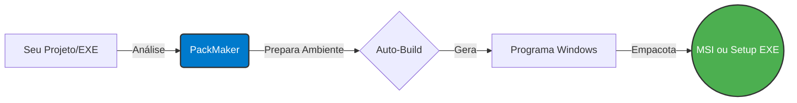

<div align="center">

<!-- Logo Placeholder: Substitua o link abaixo pela URL do logo oficial do PackMaker -->


# 📦 PackMaker

**Do código ao instalador com menos etapas manuais.**  
*Transforme projetos Python e executáveis portáteis em aplicativos e instaladores nativos para Windows sem precisar configurar correntes complexas de empacotamento.*

<!-- Badges de Status -->
[](https://github.com/seu-usuario/PackMaker)
[](https://github.com/seu-usuario/PackMaker)
[](https://python.org)
[](#-licença)

<br>

[O que é?](#-o-que-o-packmaker-faz) • 
[Fluxos](#-fluxos-suportados) • 
[Como Funciona](#-como-funciona) • 
[Instalação](#-requisitos-e-instalação) • 
[Roadmap](#-estado-do-projeto-e-pro) • 
[Contribuir](#-contribuindo)

</div>

---

## ✨ O que o PackMaker faz?

O **PackMaker** é uma ferramenta projetada para o ecossistema Windows que simplifica a geração e distribuição de programas. Esqueça a necessidade de escrever scripts complexos ou montar manualmente toda a cadeia de empacotamento. 

A edição gratuita é focada em um fluxo direto e sem atritos: **Selecione seu projeto, configure as opções principais e deixe o PackMaker fazer a mágica.**

### 🌟 Principais Destaques

*   🐍 **De Python para Windows:** Converte seus scripts e projetos Python em executáveis (`.exe`) portáteis.
*   📦 **Instaladores Nativos:** Gera instaladores `Setup.exe` ou pacotes corporativos `.MSI` diretamente do código ou de um `.exe` já existente.
*   🤖 **Inteligência de Dependências:** Não tem `requirements.txt`? Sem problemas! O PackMaker analisa seus imports e tenta identificar os pacotes automaticamente.
*   🎨 **Personalização Descomplicada:** Defina facilmente Nome, Versão, Fabricante, Ícone e opções de atalho.
*   ⚡ **Builds Inteligentes:** Sistema de cache e componentes locais que aceleram builds subsequentes, economizando tempo e banda.
*   🛡️ **Transparência Sob Demanda:** Exibe logs técnicos apenas quando você precisa, mantendo a interface amigável para usuários comuns.

---

## 🚀 Fluxos Suportados

Seja começando do zero com um projeto Python ou apenas empacotando um executável já pronto, o PackMaker se adapta à sua necessidade:

| Entrada | | Saída | Descrição |
| :--- | :---: | :--- | :--- |
| 🐍 **Projeto Python** | ➔ | ⚙️ **EXE Portátil** | Seu script convertido em um executável autônomo. |
| 🐍 **Projeto Python** | ➔ | 📦 **MSI** | Pacote Windows Installer ideal para distribuição corporativa. |
| 🐍 **Projeto Python** | ➔ | 💿 **Setup EXE** | Instalador interativo clássico para o usuário final. |
| ⚙️ **EXE Pronto** | ➔ | 📦 **MSI** | Encapsula seu portátil em um instalador MSI. |
| ⚙️ **EXE Pronto** | ➔ | 💿 **Setup EXE** | Encapsula seu portátil em um Setup executável. |

---

## 🧩 Como Funciona

Nosso objetivo é esconder a complexidade que existe entre a sua última linha de código e o instalador final na máquina do usuário.

<div align="center">


*(Dica: A visualização acima funciona nativamente no GitHub)*

</div>

1. **Preparo Automático:** O PackMaker prepara o ambiente, analisa dependências (com ou sem `requirements.txt`) e configura componentes ocultos (PyInstaller, WiX Toolset).
2. **Compilação:** O código é transformado em um binário nativo. *(Se a entrada já for um `.exe`, esta etapa é inteligentemente pulada).*
3. **Distribuição:** O instalador é gerado com as metainformações fornecidas.

---

<div align="center">
  
<!-- Placeholder para Screenshot/GIF -->

<br>
<i>Interface intuitiva do PackMaker em funcionamento.</i>

</div>

---

## 🖥️ Requisitos e Instalação

### Pré-requisitos
*   **SO:** Windows 10 ou Windows 11 (Arquitetura x64).
*   **Conexão:** Necessária apenas para a preparação inicial de componentes.
*   **Armazenamento:** Espaço livre para ambientes de build, cache e arquivos temporários.

### Executando a partir do Código-Fonte

Abra seu terminal e execute:

```bash
# 1. Clone o repositório
git clone https://github.com/SEU-USUARIO/PackMaker.git

# 2. Acesse a pasta do projeto
cd PackMaker

# 3. Execute o script principal
python main.py
```
> **Nota de Privacidade:** O PackMaker opera localmente. Componentes externos só são baixados quando ausentes. **Nunca** faça commits de certificados de assinatura, tokens ou dados sensíveis em sua fork!

---

## 📁 Estrutura de Diretórios Local

O PackMaker é organizado de forma inteligente, mantendo seus arquivos de trabalho confinados e limpos:

```text
PackMaker/
├── 📂 runtime/       # Componentes essenciais utilizados pelo PackMaker (PyInstaller, WiX, etc.)
├── 📂 cache/         # Ambientes isolados e arquivos de build reutilizáveis para velocidade
├── 📂 downloads/     # Pacotes e componentes baixados sob demanda
└── 📂 logs/          # Registros detalhados para diagnóstico e depuração
```
⚠️ *Estes diretórios são ignorados pelo Git e gerados dinamicamente durante o uso.*

---

## 🗺️ Estado do Projeto e PRO

### 🧪 Status Atual: **BETA**
Esta edição pública representa a base gratuita do PackMaker. Nosso foco durante o Beta é validar a estabilidade, a compatibilidade de projetos, a experiência do usuário e a robustez do fluxo de criação.

*Melhorias contínuas como otimizações de performance e refinamento da interface estão em constante desenvolvimento.*

### 💎 PackMaker PRO (Em Breve)
Estamos planejando uma edição **PRO**. Ela focará em:
*   Recursos avançados de personalização de instaladores.
*   Opções estendidas para desenvolvedores profissionais.
*   Tudo isso sem quebrar a nossa filosofia primária: **Poder sem complexidade excessiva**.

---

## 🐛 Reportando Problemas (Issues)

Encontrou um bug? Sendo um software em Beta, seu feedback é vital!
Ao abrir uma **[Issue](https://github.com/SEU-USUARIO/PackMaker/issues)**, por favor, inclua:

1. 🎯 **O Objetivo:** O que você estava tentando fazer?
2. 🛑 **A Etapa:** Em que momento ocorreu a falha (análise, build, empacotamento)?
3. 💬 **O Erro:** A mensagem exata exibida pelo PackMaker.
4. 🖥️ **Seu Sistema:** Versão exata do Windows.
5. 📂 **A Entrada:** Era um projeto Python puro ou um EXE pronto?

> 🔒 **Importante:** Sempre limpe seus logs de qualquer informação sensível ou credenciais antes de postá-los.

---

## 🤝 Contribuindo

Ideias, relatórios de bugs e Pull Requests são super bem-vindos! 
Para contribuições maiores ou mudanças arquiteturais, por favor, abra uma *Issue* primeiro para discutirmos a proposta. Vamos construir a melhor ferramenta de empacotamento juntos!

---

## 📄 Licença

Para detalhes sobre uso, modificação e redistribuição desta edição gratuita, por favor, consulte o arquivo [LICENSE](./LICENSE) presente neste repositório.

<br>

<div align="center">
  <b>PackMaker</b> © 2026<br>
  <i>Feito para tornar a distribuição de software no Windows invisível e indolor.</i>
</div>
