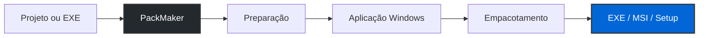

# PackMaker

<div align="center">

**Do código ao instalador com o mínimo de intervenção manual.**  
*Transforme projetos Python e executáveis portáteis em aplicativos e instaladores para Windows de forma automatizada e direta.*

[](https://github.com/seu-usuario/PackMaker)
[](https://github.com/seu-usuario/PackMaker)
[](https://www.python.org/)
[](#código-fonte-e-licença)
[](#código-fonte-e-licença)

<br>

[Visão Geral](#visão-geral) •
[Funcionalidades](#principais-funcionalidades) •
[Fluxos](#fluxos-de-trabalho) •
[Funcionamento](#arquitetura-e-funcionamento) •
[Instalação](#requisitos-e-instalação) •
[Licença](#código-fonte-e-licença) •
[PRO](#packmaker-pro)

</div>

---

## Visão Geral

O **PackMaker** é uma ferramenta para Windows criada para simplificar o processo entre um projeto de software e sua distribuição final.

A proposta é reduzir a necessidade de configurar manualmente ferramentas, comandos e diferentes etapas de empacotamento. O usuário seleciona seu projeto, configura as principais informações do aplicativo e o PackMaker prepara o restante do processo.

A edição atual é a primeira versão **Beta pública e gratuita** do projeto, destinada principalmente à criação de executáveis e instaladores para Windows a partir de projetos Python ou executáveis já existentes.

> **PackMaker ainda está em Beta.**  
> Algumas funcionalidades podem receber alterações, otimizações e correções durante o desenvolvimento.

---

## Principais Funcionalidades

- **Python → EXE:** transforma projetos Python em aplicações executáveis para Windows.

- **Python → Setup:** prepara o projeto e gera um instalador executável.

- **Python → MSI:** permite gerar diretamente um pacote Windows Installer.

- **EXE → Setup:** transforma um programa portátil já existente em um instalador.

- **EXE → MSI:** permite empacotar executáveis existentes no formato Windows Installer.

- **Dependências automáticas:** utiliza o `requirements.txt` quando disponível e também possui análise automática das dependências utilizadas pelo projeto.

- **`requirements.txt` opcional:** projetos Python simples não precisam obrigatoriamente possuir esse arquivo.

- **Configuração do aplicativo:** permite definir nome, versão, fabricante, ícone e outras informações utilizadas durante a geração.

- **Atalhos:** oferece opções básicas para criação de atalhos durante a instalação.

- **Preparação automática:** componentes necessários para o processo podem ser preparados pelo próprio PackMaker.

- **Cache de build:** arquivos e componentes reutilizáveis são mantidos localmente para acelerar operações posteriores.

- **Diagnóstico técnico:** informações detalhadas permanecem disponíveis para identificação de problemas sem ocupar desnecessariamente a experiência principal.

---

## Fluxos de Trabalho

O PackMaker adapta o processo de acordo com a entrada e o formato de saída selecionados.

| Entrada | Saída | Processo |
| :--- | :--- | :--- |
| **Projeto Python** | **EXE** | Prepara o projeto e gera uma aplicação executável para Windows. |
| **Projeto Python** | **MSI** | Prepara a aplicação e cria um pacote Windows Installer. |
| **Projeto Python** | **Setup EXE** | Prepara a aplicação e cria um instalador executável. |
| **EXE pronto** | **MSI** | Utiliza a aplicação existente e gera um pacote MSI. |
| **EXE pronto** | **Setup EXE** | Utiliza a aplicação existente e gera um instalador executável. |

---

## Arquitetura e Funcionamento

O PackMaker foi projetado para abstrair grande parte da complexidade existente entre o projeto original e o instalador entregue ao usuário final.

<div align="center">



</div>

Para projetos Python, o PackMaker prepara o ambiente necessário, analisa o projeto e gera a aplicação Windows.

Quando o usuário fornece um executável já pronto, a etapa de conversão do projeto é ignorada e o PackMaker pode seguir diretamente para a criação do instalador.

### Dependências Python

O arquivo `requirements.txt` **não é obrigatório**.

Quando presente, ele é utilizado como uma das fontes para preparação das dependências do projeto.

Quando não existe, o PackMaker pode analisar os imports encontrados no projeto e identificar automaticamente diversas dependências utilizadas pelo código.

```text
Projeto Python
      │
      ├── requirements.txt encontrado
      │          ↓
      │    utiliza dependências declaradas
      │
      └── requirements.txt ausente
                 ↓
          analisa o projeto
                 ↓
          detecta dependências
```

A detecção automática busca facilitar principalmente o empacotamento de projetos pequenos e médios sem exigir preparação manual adicional.

---

## Requisitos e Instalação

### Requisitos

- Windows 10 ou Windows 11;
- sistema x64;
- espaço disponível para arquivos temporários, cache e componentes;
- conexão com a internet quando for necessário preparar componentes ou baixar dependências.

O PackMaker mantém os componentes necessários localmente sempre que possível, evitando repetir downloads que já tenham sido concluídos.

### Executando pelo código-fonte

Clone o repositório:

```powershell
git clone https://github.com/seu-usuario/PackMaker.git
```

Entre na pasta:

```powershell
cd PackMaker
```

Execute o PackMaker:

```powershell
python main.py
```

> O nome do arquivo principal poderá variar conforme a estrutura da versão publicada.

### Versão pronta

Quando disponível, a versão compilada poderá ser obtida através da seção **Releases** deste repositório.

Não é necessário baixar o código-fonte para utilizar uma versão compilada do PackMaker.

---

## Estrutura de Dados Local

Durante sua utilização, o PackMaker pode criar diretórios locais destinados aos componentes e processos de build.

Exemplo:

```text
PackMaker/
├── runtime/
├── cache/
├── downloads/
└── logs/
```

Esses diretórios podem conter componentes preparados, ambientes temporários, caches e informações de diagnóstico.

Eles não fazem parte do código-fonte principal e não devem ser adicionados manualmente ao repositório.

---

## Código-fonte e Licença

O código-fonte do **PackMaker Standard** é disponibilizado publicamente para promover transparência, auditoria, aprendizado e colaboração com a comunidade.

O PackMaker Standard utiliza um modelo **source-available**.

Isso significa que seu código pode ser consultado e estudado publicamente, mas sua disponibilização **não concede autorização irrestrita para redistribuição, revenda, rebranding ou criação de produtos derivados do PackMaker**.

Entre os usos permitidos pela licença estão:

- utilizar gratuitamente o PackMaker Standard;
- visualizar e estudar seu código-fonte;
- modificar o código para uso pessoal ou interno;
- reportar problemas;
- propor correções e melhorias;
- contribuir com o projeto oficial;
- utilizar o PackMaker para criar programas comerciais ou gratuitos.

Alguns usos dependem de autorização prévia, incluindo a redistribuição de versões modificadas, revenda do PackMaker, rebranding e utilização substancial do código para distribuição de um produto concorrente semelhante.

### O software criado com PackMaker continua sendo seu

A licença do PackMaker aplica-se **ao PackMaker**, e não aos programas processados utilizando a ferramenta.

Se um desenvolvedor utilizar o PackMaker para transformar:

```text
MeuPrograma.py
```

em:

```text
MeuPrograma.exe
MeuPrograma.msi
MeuPrograma-Setup.exe
```

o software continua pertencendo ao desenvolvedor original.

O PackMaker **não reivindica propriedade, direitos autorais ou participação comercial** sobre programas, executáveis ou instaladores criados utilizando a ferramenta.

Isso significa que o PackMaker Standard também pode ser utilizado para criar e distribuir **software comercial**, desde que o usuário possua os direitos necessários sobre o conteúdo que está distribuindo.

> Consulte o arquivo [`LICENSE`](LICENSE) antes de redistribuir, modificar ou utilizar o código-fonte do PackMaker fora das permissões concedidas.

---

## Segurança e Privacidade

O PackMaker processa localmente os arquivos utilizados durante a geração da aplicação e do instalador.

Conexões com a internet podem ser necessárias para obtenção de componentes ou dependências que ainda não estejam disponíveis no ambiente local.

Ao contribuir com o projeto ou abrir uma Issue, **não publique informações sensíveis**, incluindo:

- senhas;
- tokens;
- chaves de API;
- certificados privados;
- chaves de assinatura;
- credenciais;
- informações pessoais presentes em logs.

---

## Tecnologias

A versão atual do PackMaker utiliza diferentes tecnologias para automatizar o pipeline de geração e empacotamento, incluindo:

- **Python**
- **PyInstaller**
- **WiX Toolset**
- **.NET**, quando necessário ao pipeline

O objetivo do PackMaker é justamente reduzir a necessidade de o usuário interagir diretamente com essas tecnologias durante o uso normal.

---

## Estado do Projeto

O PackMaker Standard encontra-se atualmente em **Beta**.

A prioridade desta fase é validar:

- estabilidade;
- compatibilidade;
- geração de executáveis;
- geração de MSI;
- geração de Setup EXE;
- gerenciamento de dependências;
- desempenho;
- experiência de utilização.

Problemas encontrados durante a Beta podem ser reportados através das **Issues** do GitHub.

---

## PackMaker PRO

O **PackMaker PRO** está planejado como uma futura edição comercial e mais avançada do projeto.

A proposta não é simplesmente adicionar uma quantidade excessiva de configurações, mas oferecer recursos profissionais mantendo a experiência acessível e organizada.

A edição PRO será desenvolvida separadamente e **não faz parte do código-fonte público do PackMaker Standard**.

Recursos, disponibilidade, preços e demais características serão divulgados conforme o desenvolvimento avançar.

---

## Contribuindo

Contribuições para o PackMaker Standard são bem-vindas dentro das condições estabelecidas pela licença do projeto.

Você pode colaborar através de:

- relatórios de bugs;
- sugestões;
- documentação;
- testes;
- correções;
- melhorias de compatibilidade;
- Pull Requests.

Para mudanças maiores, recomenda-se abrir uma **Issue** antes de iniciar a implementação.

Ao enviar uma contribuição, você concorda com os termos aplicáveis às contribuições descritos no arquivo `LICENSE`.

---

## Reportando Problemas

Ao abrir uma Issue, procure informar:

1. versão do PackMaker;
2. versão do Windows;
3. tipo de entrada utilizada — Python ou EXE;
4. saída desejada — EXE, MSI ou Setup;
5. etapa em que o problema ocorreu;
6. mensagem de erro apresentada;
7. detalhes técnicos relevantes, quando disponíveis.

Não envie projetos privados ou informações confidenciais publicamente.

---

## Licença

O **PackMaker Standard** é distribuído sob a **PackMaker Standard Source-Available License**.

Consulte o arquivo [`LICENSE`](LICENSE) para conhecer todas as permissões, limitações e condições de utilização.

Este projeto **não utiliza uma licença open source irrestrita**.

---

<div align="center">

### PackMaker

**Do código ao instalador.**

Feito para tornar a distribuição de aplicações Windows mais simples.

</div>
